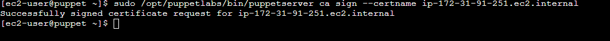
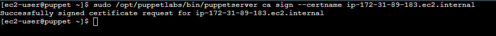
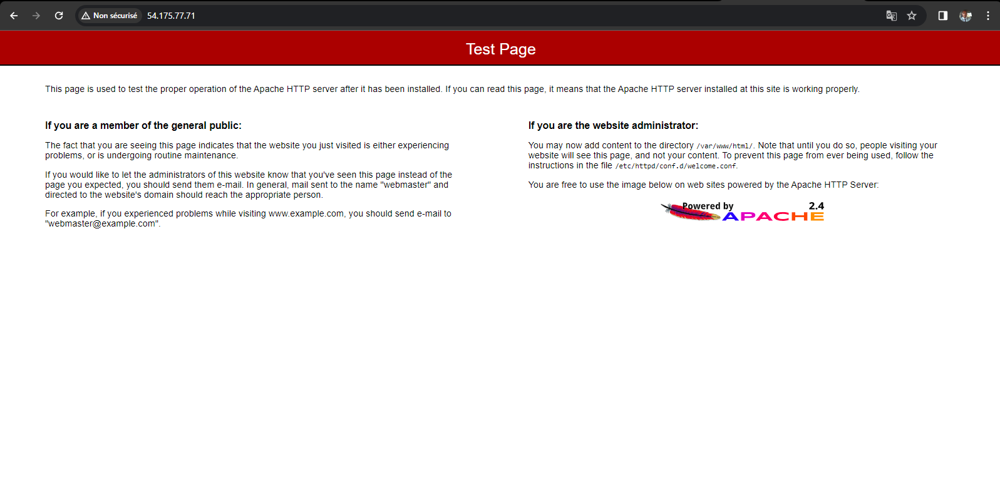
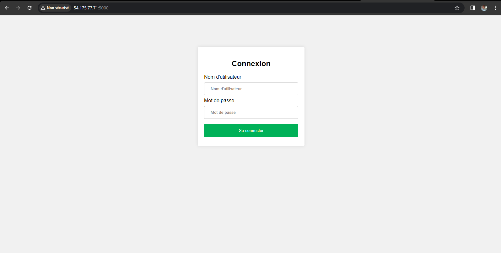

<h1>How to use puppet to automatically manage your servers configuration</h1>
<i>By Jeremie Kamuina</i> 
<addr>
  <a href="mailto:jrmkams@gmail.com">jrmkams@gmail.com</a>
   
  <a href="www.linkedin.com/in/jeremie-kamuina-129b06186">LinkedIn : www.linkedin.com/in/jeremie-kamuina-129b06186</a>
</addr>
  

  <ol> <li>
<h4><b>context:</b></h4></li> You have a server in which you want to install Apache, flask, git, clône your project from github and create a configuration file which will regulate the operation of your instance. It's simple using a few Linux commands you can install and start your applications and set up your configuration. But imagine you have 1000 servers, how do you install all these applications and make sure they are still running? this is why in this tutorial we introduce you to the Puppet tool which is a configuration manager and allows you to automate tasks in the configuration of your servers

   
  
   
  <li>
  <h4>
    <b>How does puppet work ?</b>
    </h4>
    
Puppet is based on a master-slave communication system. There is therefore a Master server and one or more slave servers linked to it. The master contains a module which in turn contains a manifest, a template and static files which can be downloaded by the slave servers  and the slaves servers contain each an agent and a factor.

    
The Slave servers sends a SSL certificate to the master to ask for a secure connection, the master responds by sinning the certificate, once the slave server (client node) is aware that the master has signed the certificate his factor analyses it's current state (configurations and installed software informations) and these informations will be sent the to master as facts and any of thoses facts will be compared to the desired state specified in Puppet manifests on the Puppet Master server. If there is a difference between them the missing elements will be installed, created or started

  
  </li>
  <li><b>Prerequisites</b></li>
  <ul type="square">
    <li>3 Amazon Linux 2 EC2 instances (CentOS 7)</li>
    <li>Allow inbound traffic for SSH (port:22), HTTP (port: 80) and TCP (port:5000) </li>
    <li>basic knowledge of linux</li>
    <li>basic knowledge of Ruby</li>
    <li>basic knowledge of git</li>
  </ul>
  <li><b>Steps</b></li>
  <h5><b>A. In the Master Server</b></h5>
  <ul type="square">
    <li>Update the server</li>
    <pre><code>sudo yum update</code></pre>
    
     
    <li>Rename the master hostname as puppet and review the new hostname</li>
     
    <pre><code>sudo hostnamectl set-hostname puppet</code></pre>
    <pre><code>hostname</code></pre>
    

      
    

    <li>Stop any running firewall if neccessary and review the firewall status</li>
    <pre><code>sudo systemctl stop firewalld</code></pre>
    <pre><code>sudo systemctl status firewalld</code></pre>
     
    
     
    <li>Download Puppet labs</li>
     
    <pre><code>sudo rpm -Uvh https://yum.puppet.com/puppet6-release-el-7.noarch.rpm</code></pre>
     
    
     
    <li>Install puppetserver</li>
     
    <pre><code>sudo yum install puppetserver -y</code></pre>
     
    
     
    <li>Configure puppetserver</li>
    <i>Open the configuration file with nano and change the memory size from 2g to 512m on "JAVA-AGS"</i>
     
     
    <pre><code>sudo nano /etc/sysconfig/puppetserver</code></pre>
     
    
     
    <i>Press Ctr + O and Enter and Ctr + x to save and quit</i>
      
    <li>Start and enable puppetserver</li>
     
    <pre><code>sudo systemctl start puppetserver</code></pre>
    <pre><code>sudo systemctl enable puppetserver</code></pre>
     
    
  </ul>
  <h5><b>B. In the Slave Server (Client Node)</b></h5>
  <i>Note : do the following steps in each of your client nodes (slave servers)</i>
    
  <ul type="square">
    <li>Add the master private ip address in the slave host configuration file</li>
    <i>Open the configuration file with nano and add the following line at the end of the file 
      your_master_private_ip_address puppet puppet-master
    </i>
    <pre><code>sudo nano /etc/hosts</code></pre>
     
    
     
    <i>Tape Ctr + O, Enter, Ctr + x to save and quit</i>
     
    <li>Download Puppet labs</li>
     
    <pre><code>sudo rpm -Uvh https://yum.puppet.com/puppet6-release-el-7.noarch.rpm</code></pre>
     
    
     
    <li>Install puppet agent</li>
     
    <pre><code>sudo yum install -y puppet-agent</code></pre>
     
    
    <li>Start puppet-agent</li>
     
     <pre><code>sudo /opt/puppetlabs/bin/puppet resource service puppet ensure=running enable=true</code></pre>
     
    
     
    <h5><b>C. In the Master Server</b></h5>
    <li>Display the list of received certificates</li>
    <pre><code>sudo /opt/puppetlabs/server/bin/puppetserver ca list --all</code></pre>
     
    
     
  <i>Note : Our master received two certificates because we have worked with two client nodes (slave instances)</i>
   
   
  <li>Sign certificates</li>
  <ul>
    <li>Sign the first client node certificate</li>
    <pre><code>sudo /opt/puppetlabs/bin/puppetserver ca sign --certname your_first_client_node_hostname</code></pre>
     
    

    <li>Sign the second client node certificate</li>
    <pre><code>sudo /opt/puppetlabs/bin/puppetserver ca sign --certname your_second_client_node_hostname</code></pre>
     
    

  </ul>
  <li>Create a manifest file and check if the file was created</li>
     
    <pre><code>sudo touch /etc/puppetlabs/code/environments/production/manifests/sample.pp</code></pre>
    <pre><code>sudo ls /etc/puppetlabs/code/environments/production/manifests/sample.pp</code></pre>
     
    
     
     <h5><b>D. In the Master Server, Write the configuration you expect to implement and maintain in your slave servers (client nodes)</b></h5>
     <li>Open the manifest sample file with nano</li>
      
     <pre><code>sudo nano /etc/puppetlabs/code/environments/production/manifests/sample.pp</code></pre>
      
     <li>Paste the following instructions</li>
     <pre><code>node 'your_slave1_hostname', 'your_slave2_hostname'
{
#Insure that httpd is installed
package{ 'httpd' :
ensure=> installed
}
file { '/etc/config':
  ensure => 'directory',
}
#insure that there is an existing config.txt file
file{
'/etc/config/config.txt':
ensure=>file
}
#Add an exec command to check for the presence of the file
exec { 'check_config':
  command => '/bin/test -f /etc/config/config.txt',
  # We use 'onlyif' option to run this command only if config.txt file does not exist
  onlyif  => '/bin/test ! -f /etc/config/config.txt',
}
#Install Python 3 if not already installed
package { 'python3':
  ensure => installed,
}

#Add an exec command to check the installed version of Python
exec { 'check_python_version':
  command     => '/usr/bin/python3 --version',
  #We use the 'unless' option to run this command only if Python 3 is not installed
  unless      => '/usr/bin/python3 --version',
  logoutput   => true, # Afficher la sortie de la commande dans les logs Puppet
}
#Install Flask with pip if it is not already installed
package { 'flask':
  ensure   => 'installed',
  provider => 'pip3',
  require  => Package['python3'], # Assurez-vous que Python 3 est installé avant d'installer Flask
}

#Add an exec command to check if Flask is installed
exec { 'check_flask':
  command     => '/usr/bin/pip3 show flask',
  logoutput   => true, # Afficher la sortie de la commande dans les logs Puppet
  unless      => '/usr/bin/pip3 show flask', # Exécuter cette commande uniquement si Flask n'est pas déjà installé
}
#Install Git if it is not already installed
package { 'git':
  ensure => 'installed',
}

#Add an exec command to check if Git is installed
exec { 'check_git':
  command     => '/usr/bin/git --version',
  logoutput   => true, # Afficher la sortie de la commande dans les logs Puppet
  unless      => '/usr/bin/git --version', # Exécuter cette commande uniquement si Git n'est pas déjà installé
}

}</code></pre>
 
<i>Note replace your_slave1_hostname and your_slave2_hostname in the above instructions  by your slave servers hostnames, tape the following command in your slave servers to get their hostnames</i>

 
<pre><code>hostname</code></pre>
 

  </ul>
<li><b>Running the slaves catalogs</b></li>
<h5><b>A. Create a scripth.sh file in the Slave Servers home directory</b></h5>
<i>Note : Do the following steps in each of your slave servers</i>
<ul type="square">
  <li>
    create a script.sh file
  </li>
  <pre><code>sudo touch script.sh</code></pre>
<li>Give the execution permission to the it</li>
<pre><code>sudo chmod 777 script.sh</code></pre>
 

 
<li>Open the script.sh file and paste the following instructions</li>
<pre><code>sudo nano script.sh</code></pre>
<i>paste the following instructions</i>
<pre><code>#!/bin/bash
sudo /opt/puppetlabs/bin/puppet agent  --test
  
#Chemin local de votre application
APPLICATION_PATH="/home/Tp1LoginJeremy"

#URL du dépôt GitHub
GITHUB_REPO="https://github.com/AWS-Re-Start-RDC-KINSHASA-1/Tp1LoginJeremy.git"

#Vérifier si le répertoire de l'application existe
if [ -d "$APPLICATION_PATH" ]; then
    echo "Le répertoire de l'application existe. Effectuer un pull depuis GitHub..."
    cd "$APPLICATION_PATH" || exit
    sudo git pull origin main
else
    echo "Le répertoire de l'application n'existe pas. Cloner depuis GitHub..."
   sudo  git clone "$GITHUB_REPO" "$APPLICATION_PATH"
fi

#Chemin vers votre application Flask

APPLICATION_PATH="/home/Tp1LoginJeremy/app.py"

#Vérifier si l'application Flask est déjà en cours d'exécution
if pgrep -f "$APPLICATION_PATH" > /dev/null; then
    echo "L'application Flask est déjà en cours d'exécution."
    exit 1
fi

#Démarrer l'application Flask en arrière-plan avec nohup
nohup python3 "$APPLICATION_PATH" &</code></pre>

  <h5><b>B. execute your script.sh file with a crontab</b></h5>
  <li>Edit your crontab</li>
  <pre><code>crontab -e</code></pre>
  <li>Paste the following instruction to execute your script.sh file every minute with a crontab</li>
  <pre><code>* * * * * /home/ec2-user/script.sh</code></code></pre>
  <i>Note: press i to switch in inserting mode</i>
   
  
  <li>To quit crontab editing press :wq and enter</li>
  <li>Restart your server to make your crontab start</li>
  </ul>

<li>Test  the result</li>
<ul type="square">
  <li>Open your web browser</li>
  <li>paste your slave instance public address</li>
  
  <i>Note the apache default page is displayed</i>
  <li>Now add a 5000 port after your slave server public address like your_slave_server_public_address:5000</li>
  <i>Review the flask login page application displayed</i>
  
</ul>
  </ol>

